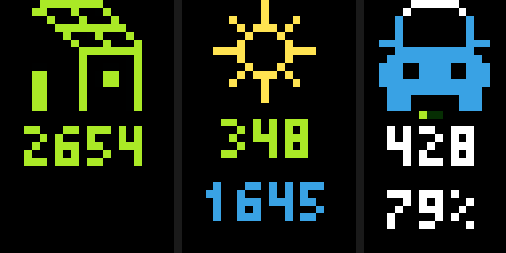

# tidbyt-evcc
[evcc](https://evcc.io/en/) is a popular open source project, allowing you to charge your BEV using as much self-generated power as possible. The project loves 💚 good UIs, a [Tidbyt](https://tidbyt.com/products/tidbyt) app displaying the most important statistics (excess solar power, charging power, state of charge) makes totally sense that's why 😀.

# Overview



The first screen is separated into 3 columns.

|column|description|
| -------- | ------- |
| 1|current photovoltaic output|
|2|☀️ or ☢️ , depending on what is winning |
||current grid power  |
||current charge power | 
|3|green dots indicating current phases  |
||vehicle range | 
||vehicle state of charge | 

The second screen is separated into 2 rows. Graphs are cached for 15 minutes.

|row|description|
| -------- | ------- |
|1|maximum photovoltaic output today|
| | maximum grid power today| 
|2|chargePowerMax |

> [!IMPORTANT]
> By default, when the car is not connected to a charger, SOC and range are not updated. Check evcc [loadpoint](https://docs.evcc.io/en/docs/reference/configuration/loadpoints#soc) documentation how to change this behaviour.


# Setup

## Signup to InfluxDB Cloud Serverless

Tidbyt apps are designed to query data only from public API endpoints, not from any local LAN device. evcc typically runs in your LAN on a Raspberry Pi or similar. However for security reasons exposing the evcc API endpoint to the public internet using DynDNS or so is not ideal too.

The approach is to use a [InfluxDB Cloud Serverless](https://www.influxdata.com/influxdb-cloud-pricing/) with a "Free Plan", allowing to keep 30 days of data and sufficient API requests for reading and writing data.

* Signup for InfluxDB Cloud [InfluxDB Signup page](https://cloud2.influxdata.com/signup)
* select a region of your choice (EU Frankfurt, US East (Virginia))
* create an organisation and bucket (for simplicity I called both `evcc`) 
* create an API token for writing into the evcc bucket (for evcc)
* create an API token for reading from the evcc bucket (for the Tidbyt app) 

## Setup evcc InfluxDB v2.x integration

Following [evcc InfluxDB v2.x](https://docs.evcc.io/docs/reference/configuration/influx/#influxdb-v2x) documentation, the `evcc.yaml` is configured like this:

```
influx:
  url: https://eu-central-1-1.aws.cloud2.influxdata.com # make sure this fits to the region you picked
  database: evcc # InfluxDB v2.x uses term `bucket` but for compatibility still named `database` here
  token: <YOUR WRITE TOKEN HERE>
  org: evcc # if you named your organisation differently, please adjust here
```

Restart your evcc and check the logs for errors.

## Verify your setup

Use the InfluxDB "Data Explorer" to verify evcc is able to send metrics.

* select the bucket `evcc`
* pick measurement `gridPower` 
* run the query

You should see some query results matching the statistics of your evcc installation.


## InfluxDB measurements taken into consideration


|metric|description|
| -------- | ------- |
|gridPower|Current grid feed-in (green) or consumption (red)|
|chargePower|Current charging power|
|homePower|Current house consumption power (without wallbox consumption)|
|phasesActive|Currently active number of current phases of the charging point|
|pvPower|Current solar system output|
|vehicleSoc|Current vehicle state of charge (Soc) in percent|

For more details on measurements check out the [evcc  messaging](https://github.com/evcc-io/docs/blob/main/docs/reference/configuration/messaging.md) documentation.

# Credits

Icons created by my colleague Alvaro, who is abstinent from social media, hence no link here.